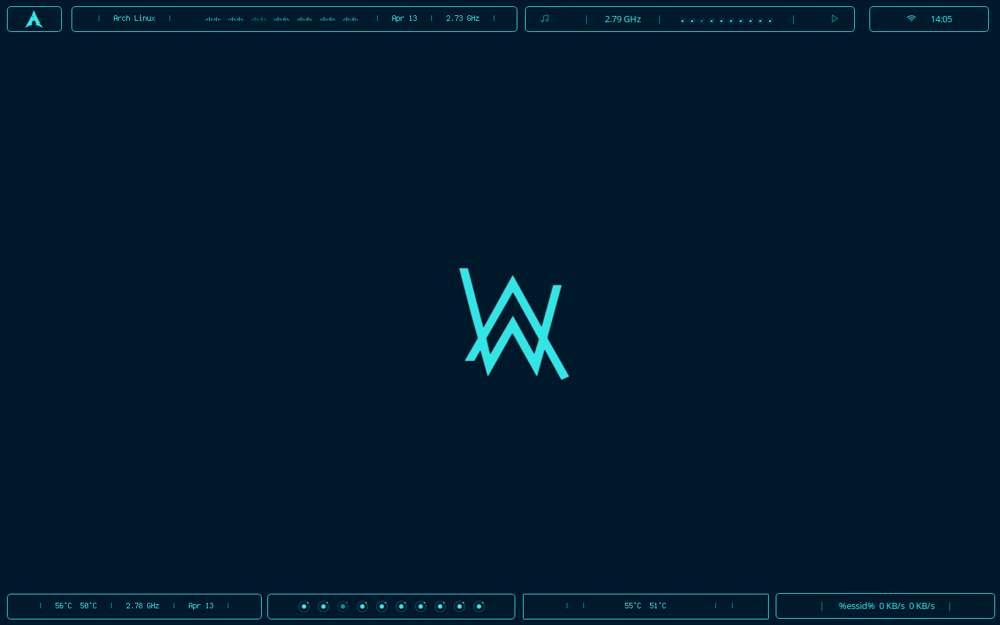

# polybar-theme-hack-purple
Presento un tema perzonalizado con modulos integrados dirigido a polybar

#


# Instalacion

Copie y pegue lo siguiente en su terminal como usuario normal para una instalacion automatica.

```shell
git clone https://github.com/herbstluft/polybar-theme-hack-blue.git && cd polybar-theme-hack-blue && chmod +x install && ./install
```
